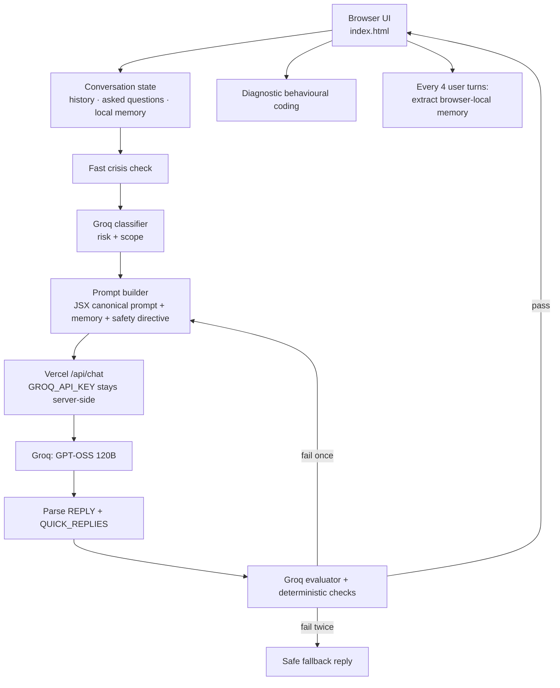

# Sukoon — Mental Wellbeing Chat companion prototype (based on Vercel, OpenRouter, Groq implementation)

Sukoon is a browser-based prototype of a reflective mental-wellbeing companion.

## Architecture

Browser
→ `/api/chat`
→ Vercel Node.js Function
→ Groq API

The Groq API key is **never placed in the browser**.

## Deploy to Vercel

1. Push this folder to a GitHub repository.
2. Import the repository into Vercel.
3. In Vercel → Project → Settings → Environment Variables, add:

`GROQ_API_KEY` = your Groq API key

4. Enable it for Preview and/or Production as required.
5. Redeploy.

Vercel exposes environment variables to server-side Functions through `process.env`.

## Local development

Install Vercel CLI:

```bash
npm install -g vercel
```

Then:

```bash
vercel login
vercel link
vercel env pull .env.local
vercel dev
```

Alternatively, create `.env.local` yourself:

```text
GROQ_API_KEY=your_key_here
```

Do not commit `.env.local`.

## Files

- `index.html` — chat UI, safety flow, local session state, and rendering
- `api/chat.js` — secure Groq proxy
- `conversation/prompt.js` — canonical conversation prompt shared with the JSX testbench
- `conversation/test-scenarios.js` — frozen multi-turn fixtures for prompt regression testing
- `package.json` — minimal Vercel project configuration
- `.gitignore` — prevents local secrets from being committed

## Important prototype note

For the demo, factual memory and aggregate diagnostic metrics are stored in browser-local storage. They persist only in that browser and are not shared across devices or users.

The production conversation prompt is the same canonical prompt used by the question-sequencing testbench. The app retains its existing crisis routing, scope checks, reply evaluation, retry, and local-memory flow around that prompt.

Run `npm run verify:conversation` to validate the canonical prompt structure and the frozen test scenarios after prompt changes.


## Diagnostic build
This temporary build surfaces the exact Groq/Vercel stage and HTTP error when an AI call fails. Replace with the normal build after diagnosis.

## Architecture

